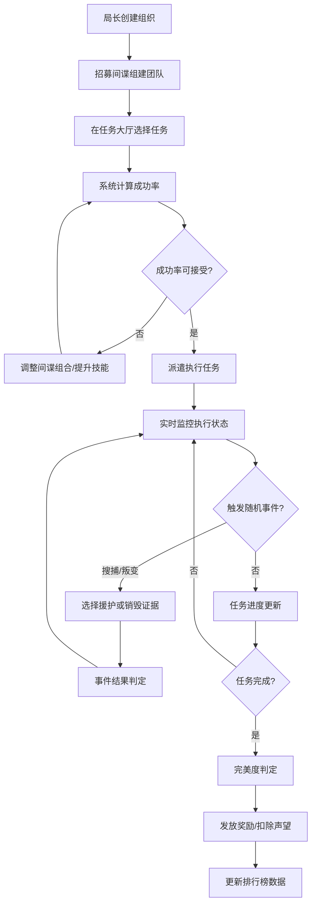
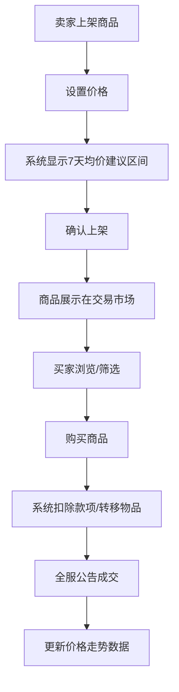

## 1. 产品概述

多人在线魔法世界情报事务所与间谍网络系统，玩家创建情报组织、招募间谍、执行机密任务、交易情报、组建公会，构建庞大的地下情报网络。

- 核心玩法：间谍养成 + 任务策略 + 情报交易 + 公会协作
- 目标用户：喜欢策略养成、多人协作、RPG元素的玩家
- 产品价值：提供沉浸式魔法世界间谍体验，支持数千人实时交互

## 2. 核心功能

### 2.1 用户角色

| 角色 | 注册方式 | 核心权限 |
|------|---------|---------|
| 情报局长 | 账号注册/登录 | 创建组织、招募间谍、发布任务、交易情报、加入公会 |
| 系统管理员 | 后台登录 | 数据监控、活动发布、违规处理 |

### 2.2 功能模块

1. **组织管理**：创建情报组织、设立代号据点、声望系统、暴露风险
2. **间谍管理**：招募间谍、技能养成（隐匿/伪装/破解）、属性管理
3. **任务系统**：暗杀/窃取/渗透任务、成功率计算、实时执行、随机事件
4. **情报交易**：情报卷轴买卖、间谍契约交易、智能定价建议、全服公告
5. **公会系统**：联合情报站、加密通讯塔、材料捐献、集体加成
6. **情报报告**：每周产业报告、热力图、成功率曲线、价格走势、PDF导出
7. **排行榜**：情报总值、任务完美度、公会贡献全服排名

### 2.3 页面详情

| 页面名称 | 模块名称 | 功能描述 |
|---------|---------|---------|
| 首页/仪表盘 | 总览模块 | 组织状态概览、任务进度、通知中心、快捷操作 |
| 组织管理 | 组织信息 | 组织名称、代号、据点位置、声望等级、暴露风险 |
| 间谍管理 | 间谍列表 | 所有间谍展示、技能属性、状态管理、招募入口 |
| 间谍详情 | 间谍养成 | 属性面板、技能升级、装备情报卷轴 |
| 任务大厅 | 任务列表 | 可接任务展示、难度分级、成功率预估 |
| 任务执行 | 实时监控 | 间谍状态实时更新、事件触发、援护/销毁操作 |
| 交易市场 | 情报交易 | 情报卷轴买卖、价格走势图、交易记录 |
| 契约市场 | 间谍交易 | 间谍契约挂牌、智能定价建议、成交公告 |
| 公会大厅 | 公会信息 | 公会资料、成员列表、贡献排名 |
| 公会建筑 | 建筑管理 | 联合情报站、加密通讯塔升级、材料捐献 |
| 情报报告 | 数据报告 | 区域热力图、成功率曲线、价格走势分析 |
| 排行榜 | 排名展示 | 个人/公会多维度排名、历史数据对比 |

## 3. 核心流程

### 3.1 任务执行流程

### 3.2 情报交易流程

## 4. 用户界面设计

### 4.1 设计风格

- **主色调**：深紫 (#1a0a2e) + 暗金 (#d4af37) + 魔法蓝 (#2d1b69)
- **辅助色**：猩红 (#8b0000)（警告）、翠绿 (#006400)（成功）、橙黄 (#ff8c00)（注意）
- **背景**：深色渐变 + 魔法粒子动效 + 情报网络纹理
- **按钮风格**：哥特式立体按钮，金属边框，悬停发光效果
- **字体**：Cinzel Decorative（标题/哥特风）+ JetBrains Mono（数据/代码）
- **布局**：不对称卡片布局，情报网连接线动效，复古羊皮纸与未来科技融合
- **图标风格**：魔法符文风格，线条优雅，带微光效果

### 4.2 页面设计概述

| 页面名称 | 模块名称 | UI元素 |
|---------|---------|---------|
| 仪表盘 | 总览模块 | 魔法水晶球状态显示、羊皮纸风格卡片、实时数据滚动条 |
| 间谍管理 | 间谍列表 | 塔罗牌风格卡片、技能雷达图、状态光效指示 |
| 任务执行 | 实时监控 | 地图路径动画、实时属性曲线、事件弹窗特效 |
| 交易市场 | 情报交易 | 加密卷轴展示、K线价格走势、成交闪烁公告 |
| 公会建筑 | 建筑管理 | 3D魔法建筑展示、材料进度条、升级光效 |
| 情报报告 | 数据报告 | 区域热力图、多维度雷达图、趋势曲线图 |

### 4.3 响应式设计

- **桌面端优先**：1920px 布局为基准，采用 12 列栅格系统
- **平板适配**：1024px 断点，侧边栏可收起，卡片自适应排列
- **移动端**：768px 断点，底部导航栏，单列布局，触控优化
- **触控优化**：按钮最小 48px，滑动手势支持，关键操作二次确认

### 4.4 动效设计

- **页面入场**：魔法粒子汇聚成形，卡片错落淡入
- **状态变化**：数值变化滚动动画，属性条平滑过渡
- **任务执行**：地图路径流光动画，事件触发震动效果
- **成交公告**：全屏横幅闪烁，金色粒子爆发
- **建筑升级**：魔法阵旋转发光，建筑升级变形动画
