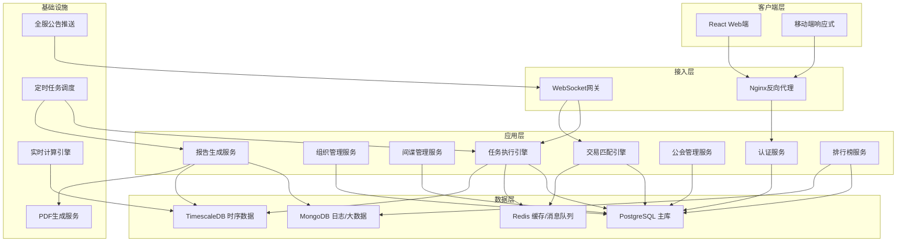
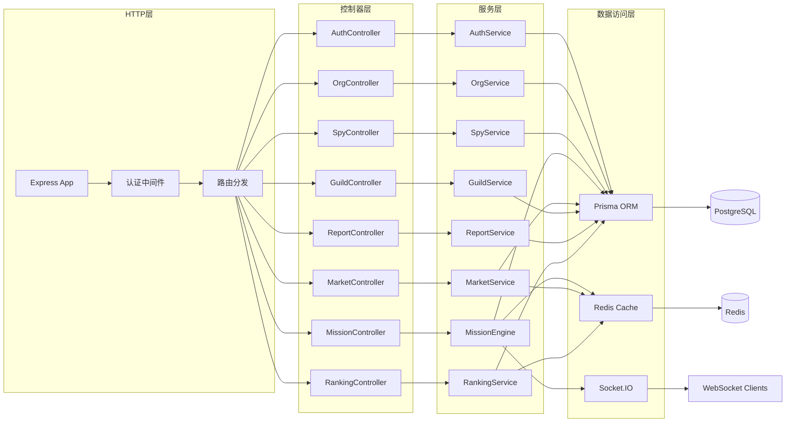
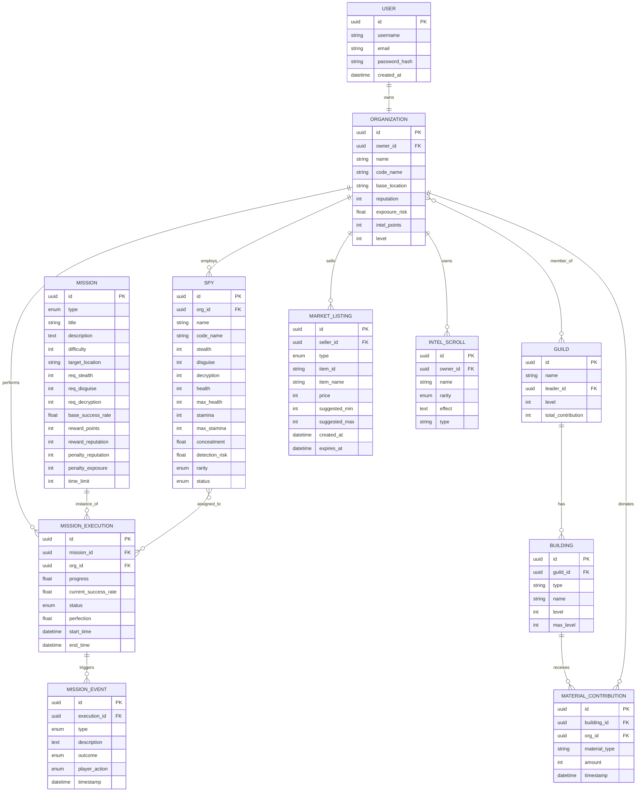
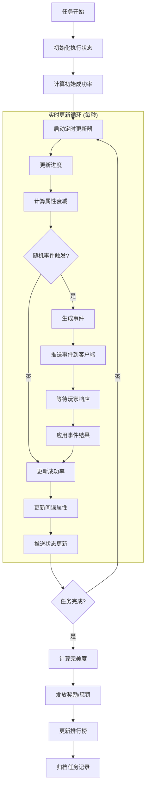
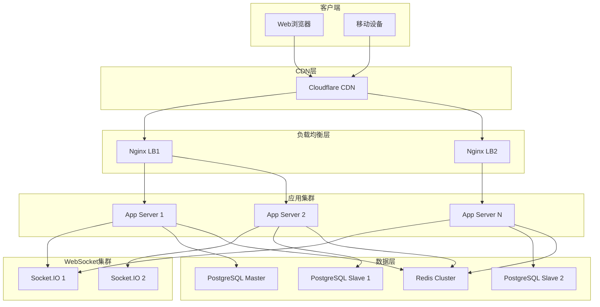

## 1. 架构设计



## 2. 技术描述

### 2.1 前端技术栈
- **框架**: React@18 + TypeScript
- **构建工具**: Vite@5
- **状态管理**: Zustand@4 + React Query
- **路由**: React Router DOM@6
- **UI框架**: TailwindCSS@3 + 自定义哥特风组件库
- **图表**: Recharts@2 + ECharts@5
- **实时通信**: Socket.IO-client
- **PDF导出**: jspdf@2 + html2canvas@1
- **图标**: Lucide React + 自定义魔法符文SVG
- **动画**: Framer Motion@11

### 2.2 后端技术栈
- **框架**: Express@4 + TypeScript
- **实时通信**: Socket.IO@4
- **数据库**: PostgreSQL@14 + Redis@7
- **ORM**: Prisma@5
- **认证**: JWT + bcrypt
- **任务调度**: node-cron@3
- **验证**: Zod@3
- **日志**: Winston@3

### 2.3 性能优化方案
- **缓存策略**: Redis热点数据缓存 + 任务结果缓存
- **连接池**: 数据库连接池 + Redis连接池
- **消息队列**: BullMQ处理异步任务
- **数据分片**: 玩家数据按区域分片存储
- **负载均衡**: Nginx轮询 + 会话粘滞

## 3. 路由定义

### 3.1 前端路由

| 路径 | 页面 | 说明 |
|------|------|------|
| / | 仪表盘 | 组织状态总览 |
| /organization | 组织管理 | 情报组织信息 |
| /spies | 间谍列表 | 所有间谍管理 |
| /spies/:id | 间谍详情 | 单个间谍养成 |
| /missions | 任务大厅 | 可接任务列表 |
| /missions/:id | 任务执行 | 实时任务监控 |
| /market/intel | 情报市场 | 情报卷轴交易 |
| /market/contracts | 契约市场 | 间谍契约交易 |
| /guild | 公会大厅 | 公会信息与成员 |
| /guild/buildings | 公会建筑 | 联合建筑管理 |
| /reports | 情报报告 | 产业数据报告 |
| /rankings | 排行榜 | 全服排名展示 |
| /login | 登录页 | 用户登录 |
| /register | 注册页 | 创建账号 |

### 3.2 后端API路由

| 方法 | 路径 | 模块 | 说明 |
|------|------|------|------|
| POST | /api/auth/login | 认证 | 用户登录 |
| POST | /api/auth/register | 认证 | 用户注册 |
| GET | /api/organization | 组织 | 获取组织信息 |
| POST | /api/organization | 组织 | 创建/更新组织 |
| GET | /api/spies | 间谍 | 获取间谍列表 |
| POST | /api/spies/recruit | 间谍 | 招募新间谍 |
| PUT | /api/spies/:id/upgrade | 间谍 | 升级间谍技能 |
| GET | /api/missions | 任务 | 获取可用任务 |
| POST | /api/missions/:id/accept | 任务 | 接受任务 |
| POST | /api/missions/:id/support | 任务 | 派遣援护 |
| POST | /api/missions/:id/destroy | 任务 | 销毁证据 |
| GET | /api/market/intel | 交易 | 获取情报列表 |
| POST | /api/market/intel | 交易 | 上架情报 |
| POST | /api/market/intel/:id/buy | 交易 | 购买情报 |
| GET | /api/guild | 公会 | 获取公会信息 |
| POST | /api/guild/buildings/:id/upgrade | 公会 | 升级建筑 |
| POST | /api/guild/buildings/:id/donate | 公会 | 捐献材料 |
| GET | /api/reports/weekly | 报告 | 获取周报数据 |
| GET | /api/reports/export | 报告 | 导出PDF |
| GET | /api/rankings/:type | 排行榜 | 获取排名数据 |

## 4. API类型定义

```typescript
// 组织类型
interface Organization {
  id: string;
  name: string;
  codeName: string;
  baseLocation: string;
  reputation: number;
  exposureRisk: number;
  intelPoints: number;
  level: number;
  createdAt: Date;
}

// 间谍类型
interface Spy {
  id: string;
  name: string;
  codeName: string;
  organizationId: string;
  skills: {
    stealth: number;      // 隐匿
    disguise: number;     // 伪装
    decryption: number;   // 破解
  };
  stats: {
    health: number;
    maxHealth: number;
    stamina: number;
    maxStamina: number;
    concealment: number;   // 隐匿值
    detectionRisk: number; // 被发现风险
  };
  rarity: 'common' | 'rare' | 'epic' | 'legendary';
  status: 'idle' | 'mission' | 'training' | 'injured';
  equipedScrolls: string[];
}

// 任务类型
interface Mission {
  id: string;
  type: 'assassination' | 'theft' | 'infiltration';
  title: string;
  description: string;
  difficulty: number;
  targetLocation: string;
  requiredSkills: Partial<Spy['skills']>;
  baseSuccessRate: number;
  rewards: {
    intelPoints: number;
    reputation: number;
    scrolls: string[];
  };
  penalties: {
    reputationLoss: number;
    exposureIncrease: number;
  };
  timeLimit: number;
}

// 任务执行状态
interface MissionExecution {
  id: string;
  missionId: string;
  organizationId: string;
  spyIds: string[];
  startTime: Date;
  endTime: Date | null;
  progress: number;
  currentSuccessRate: number;
  status: 'in_progress' | 'completed' | 'failed';
  perfection: number;
  events: MissionEvent[];
  realtimeStats: {
    concealment: number;
    detectionRisk: number;
    stamina: number;
  };
}

// 任务事件
interface MissionEvent {
  id: string;
  type: 'patrol' | 'betrayal' | 'discovery' | 'trap' | 'opportunity';
  timestamp: Date;
  description: string;
  resolved: boolean;
  playerAction?: 'support' | 'destroy' | 'none';
  outcome: 'positive' | 'negative' | 'neutral';
}

// 交易商品
interface MarketListing {
  id: string;
  sellerId: string;
  sellerName: string;
  type: 'intel_scroll' | 'spy_contract';
  itemId: string;
  itemName: string;
  itemRarity: string;
  price: number;
  suggestedPriceRange: [number, number];
  createdAt: Date;
  expiresAt: Date;
}

// 公会类型
interface Guild {
  id: string;
  name: string;
  leaderId: string;
  memberIds: string[];
  level: number;
  buildings: {
    intelStation: Building;
    commTower: Building;
  };
  totalContribution: number;
}

interface Building {
  type: string;
  name: string;
  level: number;
  maxLevel: number;
  effect: string;
  requiredMaterials: MaterialRequirement[];
  currentMaterials: Record<string, number>;
}

// 排行榜条目
interface RankingEntry {
  rank: number;
  playerId: string;
  playerName: string;
  value: number;
  change: number;
}
```

## 5. 服务端架构图



## 6. 数据模型

### 6.1 ER图



### 6.2 关键索引

```sql
-- 组织索引
CREATE INDEX idx_org_owner ON organizations(owner_id);
CREATE INDEX idx_org_reputation ON organizations(reputation DESC);
CREATE INDEX idx_org_intel_points ON organizations(intel_points DESC);

-- 间谍索引
CREATE INDEX idx_spy_org ON spies(organization_id);
CREATE INDEX idx_spy_status ON spies(status);
CREATE INDEX idx_spy_rarity ON spies(rarity);

-- 任务执行索引
CREATE INDEX idx_exec_org ON mission_executions(organization_id);
CREATE INDEX idx_exec_mission ON mission_executions(mission_id);
CREATE INDEX idx_exec_status ON mission_executions(status);
CREATE INDEX idx_exec_start_time ON mission_executions(start_time DESC);

-- 交易索引
CREATE INDEX idx_market_seller ON market_listings(seller_id);
CREATE INDEX idx_market_type ON market_listings(type);
CREATE INDEX idx_market_price ON market_listings(price);
CREATE INDEX idx_market_expires ON market_listings(expires_at);

-- 排行榜索引（按类别分区）
CREATE INDEX idx_rankings_intel ON organizations(intel_points DESC) WHERE intel_points > 0;
CREATE INDEX idx_rankings_perfection ON mission_executions(perfection DESC) WHERE status = 'completed';
```

## 7. 实时任务引擎架构



## 8. 部署架构


